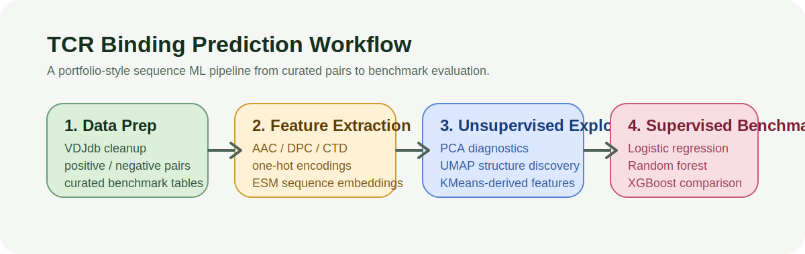
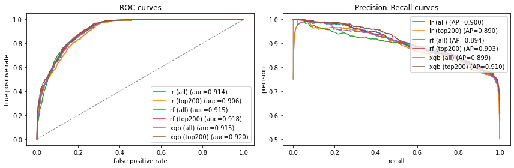
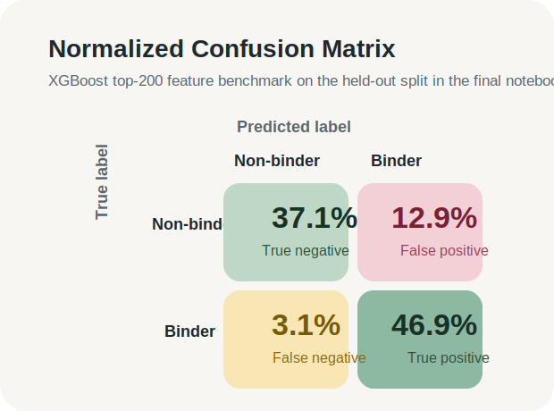
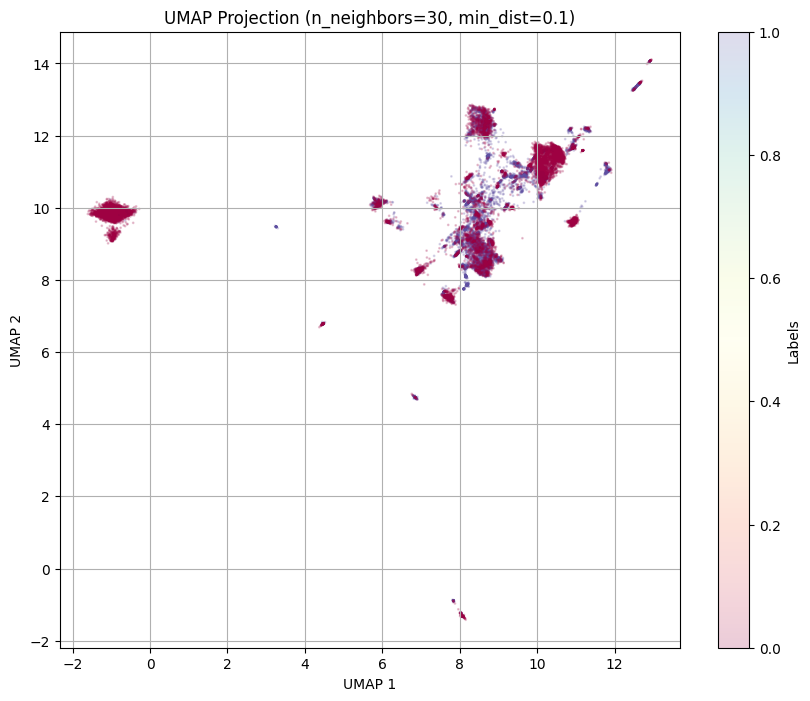

# TCR Binding Prediction

TCR Binding Prediction is a sequence ML benchmark and case study built around T-cell receptor and epitope binding prediction. The project packages an end-to-end workflow across curated immunology data, representation engineering, unsupervised exploration, and supervised benchmarking into a single portfolio-quality repository.

## Project Positioning

This repository is intentionally presented as a `benchmark / case study`.

Its purpose is to show complete sequence-ML execution from data preparation to model comparison and result communication, with an emphasis on clarity, reproducibility, and portfolio-ready presentation.

## Problem

Predicting whether a T-cell receptor is likely to bind a target antigen epitope is a difficult sequence-learning problem with clear relevance to immunology, therapeutic discovery, and candidate prioritization. This project focuses on the practical ML question: how far can curated sequence features and compact benchmarks take us on TCR-epitope binding prediction?

## Dataset

- `VDJdb` is the primary source for curated TCR-epitope binding records.
- The repository includes processed artifacts under [`Datasets`](/Users/newuser/TCR_Binding_Prediction/Datasets) for benchmark-style experiments.
- `TRAITdb` is included as an auxiliary validation-style dataset in the broader project workflow.
- The recommended benchmark-friendly feature table is packaged as `Datasets/VDJdb_CN_PP.zip`, which contains the curated representation-engineered CSV used in the final comparison workflow.

## Representation Methods

- amino acid composition descriptors
- dipeptide composition features
- CTD physicochemical descriptors
- one-hot encodings for TCR and epitope sequences
- ESM protein language model embeddings
- PCA, UMAP, and KMeans-derived unsupervised features

## Models Compared

- Logistic Regression
- Random Forest
- XGBoost

The final benchmark compares both full feature sets and top-200 feature subsets selected from model-specific importance signals.

## Top Results

The strongest headline result in the final benchmark lineage is:

- `XGBoost (top 200 features)`: `ROC-AUC 0.9198`, `F1 0.8541`, `Accuracy 0.8399`, `Precision 0.7844`, `Recall 0.9374`

Additional benchmark snapshots from the same notebook:

| Model | Setting | ROC-AUC | F1 | Accuracy |
| --- | --- | ---: | ---: | ---: |
| Logistic Regression | all features | 0.9136 | 0.8442 | 0.8328 |
| Random Forest | all features | 0.9147 | 0.8510 | 0.8389 |
| XGBoost | all features | 0.9145 | 0.8497 | 0.8351 |
| Logistic Regression | top 200 | 0.9061 | 0.8410 | 0.8261 |
| Random Forest | top 200 | 0.9184 | 0.8482 | 0.8391 |
| XGBoost | top 200 | **0.9198** | **0.8541** | **0.8399** |

## Workflow



The project is organized around four stages:

1. `data prep`
2. `feature extraction`
3. `unsupervised exploration`
4. `supervised benchmark`

## Recommended Entry

The repo is script-first for a quick, reproducible starting point.

### 1. Setup

```bash
python3 -m venv .venv
source .venv/bin/activate
pip install -r requirements.txt
```

For the notebook stack and extra visualization tooling:

```bash
pip install -r requirements-notebooks.txt
```

### 2. Train the baseline

[`train_baseline.py`](/Users/newuser/TCR_Binding_Prediction/train_baseline.py) is the main entrypoint.

```bash
python3 train_baseline.py \
  --vdjdb-path Datasets/VDJdb_clean.xlsx \
  --model-out artifacts/tcr_binding_baseline.pkl
```

Optional external-style validation:

```bash
python3 train_baseline.py \
  --vdjdb-path Datasets/VDJdb_clean.xlsx \
  --model-out artifacts/tcr_binding_baseline.pkl \
  --validate-trait
```

### 3. Run the small demo

[`sample_inference.py`](/Users/newuser/TCR_Binding_Prediction/sample_inference.py) loads a trained artifact and scores one pair or a CSV batch.

```bash
python3 sample_inference.py \
  --model artifacts/tcr_binding_baseline.pkl \
  --tcr CASSTRSSYEQYF \
  --epitope GILGFVFTL
```

## Notebooks

The main presentation lives directly in this `README`, with the notebooks preserved as the original exploratory workflow.

If you want the original exploratory workflow, the source notebooks are available under [`notebooks`](/Users/newuser/TCR_Binding_Prediction/notebooks):

- [`notebooks/01_feature_extraction.ipynb`](/Users/newuser/TCR_Binding_Prediction/notebooks/01_feature_extraction.ipynb)
- [`notebooks/02_unsupervised_exploration.ipynb`](/Users/newuser/TCR_Binding_Prediction/notebooks/02_unsupervised_exploration.ipynb)
- [`notebooks/03_supervised_benchmark_v3.ipynb`](/Users/newuser/TCR_Binding_Prediction/notebooks/03_supervised_benchmark_v3.ipynb)
- [`notebooks/04_supervised_benchmark_v4.ipynb`](/Users/newuser/TCR_Binding_Prediction/notebooks/04_supervised_benchmark_v4.ipynb)

Course-era extras and withdrawn presentation-only files remain in [`docs/archive`](/Users/newuser/TCR_Binding_Prediction/docs/archive).

## Results Gallery

### ROC / PR Curves



### Confusion Matrix



### Embedding Visualization



## Scope And Notes

- This repository focuses on a curated benchmark workflow for sequence ML.
- Negative examples are generated for supervised comparison, so reported performance reflects the benchmark construction used in this project.
- The strongest results come from notebook-driven experimentation supported by reusable scripts and curated artifacts.
- Biological validation, calibration under broader deployment settings, and uncertainty analysis are natural next-step extensions.
- The overall scope is optimized for a complete, polished showcase of end-to-end ML work.

## Repository Notes

- [`supervised_learning.py`](/Users/newuser/TCR_Binding_Prediction/supervised_learning.py) remains the reusable training foundation used by the script entrypoint.
- Original exploratory preprocessing scripts now live in [`scripts`](/Users/newuser/TCR_Binding_Prediction/scripts).
- [`docs/archive/MilestoneII_FinalReport_Group7.pdf`](/Users/newuser/TCR_Binding_Prediction/docs/archive/MilestoneII_FinalReport_Group7.pdf) is preserved as project provenance and historical context.
- Original exploratory notebooks live in [`notebooks`](/Users/newuser/TCR_Binding_Prediction/notebooks), while older support material stays in [`docs/archive`](/Users/newuser/TCR_Binding_Prediction/docs/archive).
